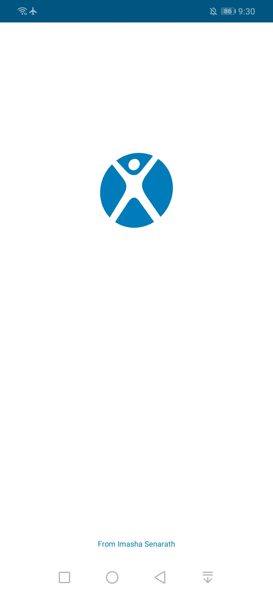
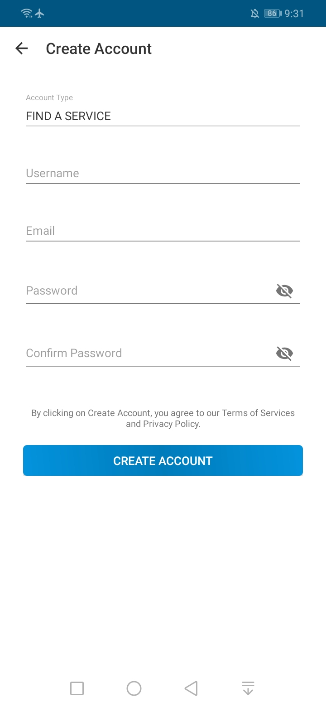
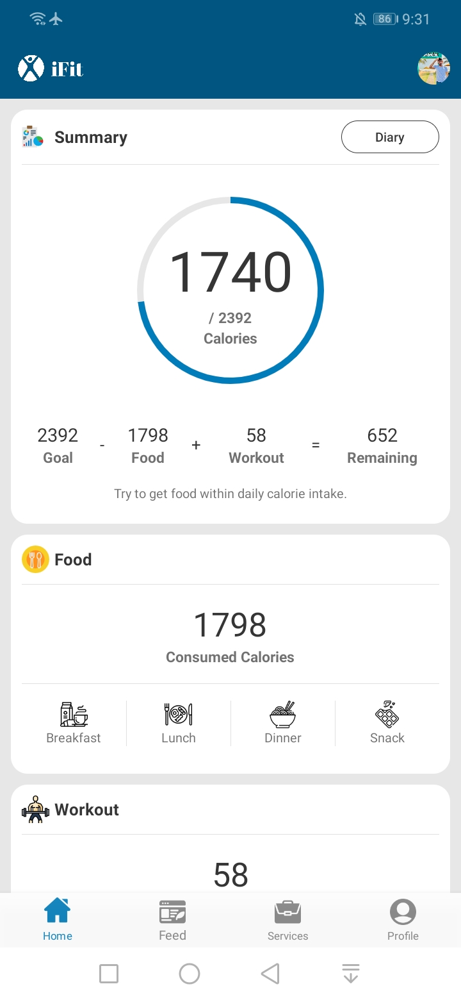

<h1> iFit </h1>

A Fitness Tracker App, built with Java and Firebase, connects users with fitness community, professionals and resources for a healthier lifestyle. It also offers fitness tracking, nutrition plans, and more to enhance health and fitness.

Note: This app is a my university final year project.

<h2> ⚙️ Technologies </h2>
<ul>
</ul>

<h2> 🔥 Features </h2>
<ul>
</ul>
  
<h2> 📸 Screenshots </h2>

 

 

To see all screenshots, check the "ss" folder.

<h2> 👽 Author </h2>
<a href="https://www.imashasenarath.com/" target="_blank"><strong>Imasha Senarath</strong></a>

<h2> © Credits </h2>

All icons, images, and other media used in this project are the property of their respective copyright owners. Their rights are fully acknowledged and respected.
